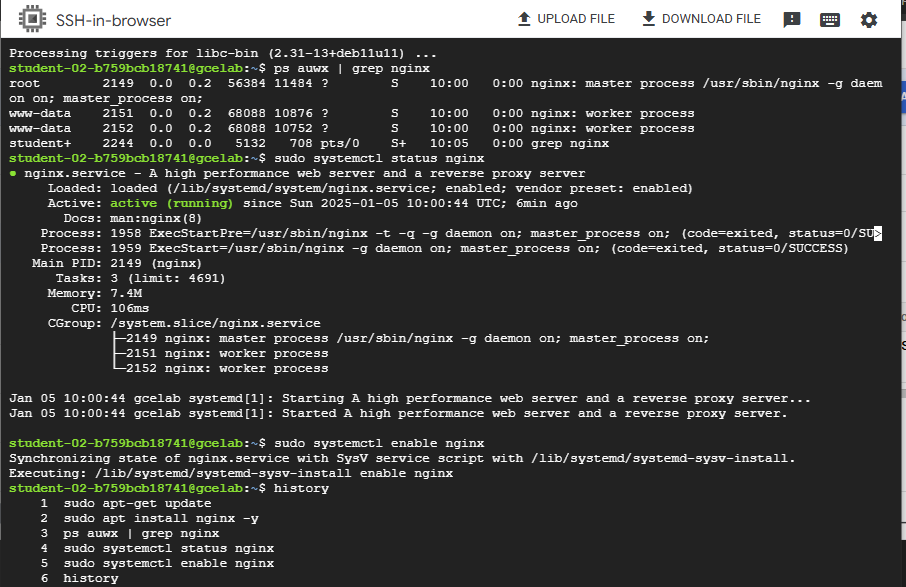
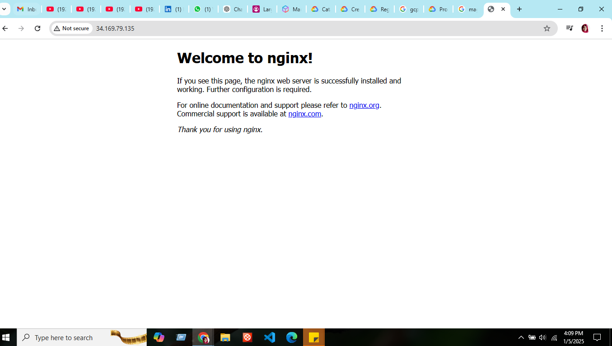
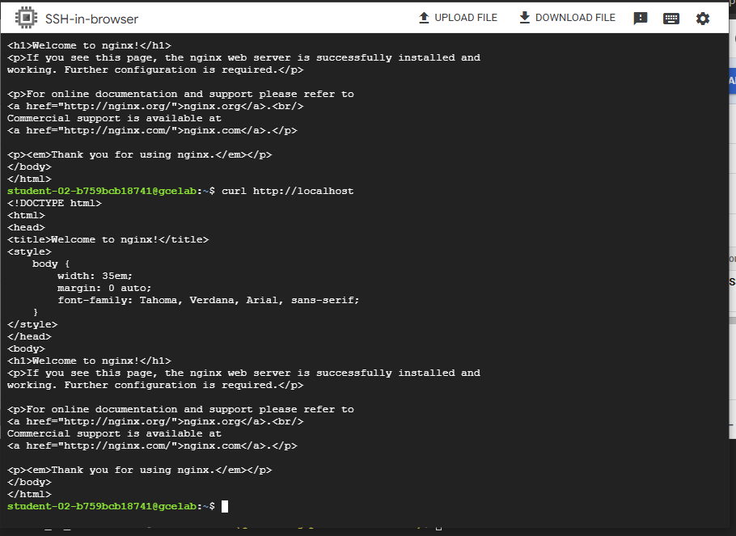

# README: Creating a VM in GCP and Installing NGINX

## Overview
This guide walks you through creating a Virtual Machine (VM) on Google Cloud Platform (GCP) and installing the NGINX web server. NGINX is a popular open-source web server used for hosting web applications, load balancing, and reverse proxying.

---

## Prerequisites
1. **GCP Account**: I have used Google Cloud Skill Boost free credits to use GCP lab

---

## Steps

### Step 1: Create a New VM Instance
1. **Go to the GCP Console**:
   - Navigate to the **Compute Engine Instances** page

2. **Create a New VM**:
   - Click **Create Instance**.
   - **Name**: Enter a name for my instance (gcelab)
   - **Region/Zone**: Select the region and zone 
   - **Machine Type**: Choose a machine type `e2-medium`
   - **Boot Disk**:
     - Click **Change** to select an OS.
     - Choose **CentOS Linux**
     - Click **Select**.
   - **Firewall Rules**:
     - Check the boxes for **Allow HTTP traffic** 

3. **Create**:
   - Click **Create** to launch the instance.

### Step 2: Connect to the VM Instance
1. Once the VM is running, use the Cloud SDK:

   ```bash
   gcloud compute ssh <instance-name> --zone <zone>
   ```

### Step 3: Update the Package List
Run the following command to update the package list:
```bash
sudo apt update
```

### Step 4: Install NGINX
Install NGINX using the following command:
```bash
sudo apt install nginx -y
```

### Step 5: Start and Enable NGINX
Ensure NGINX is running and set to start on boot:
```bash
sudo systemctl start nginx
sudo systemctl enable nginx
```



### Step 6: Verify NGINX Installation
1. Open the browser and enter the external IP address of my VM 
2. The default NGINX welcome page is visible

 

 
4. Or we can use the following command to check nginx connectivity: curl http://localhost


---


